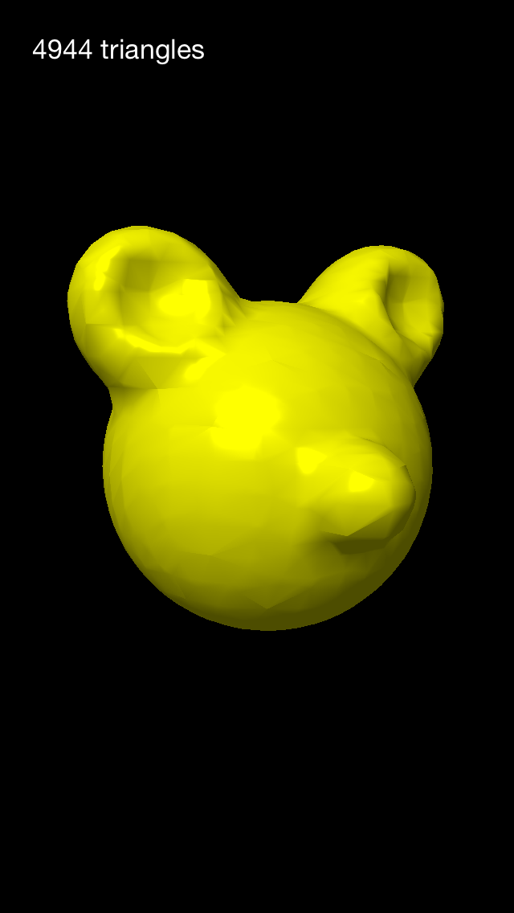

# Marching Tetrahedra

An implementation of [Marching Tetrahedra][1] for iOS, written using SceneKit and Swift.

</img>

## Known issues

Crashes in the 64-bit simulator with `C3DRendererContextSetupResidentMeshSourceAtLocation - double not supported`

## Acknowledgements

Thanks to [David Ronnqvist][2] for his [Custom SceneKit geometry][3] blog post

[1]: http://en.wikipedia.org/wiki/Marching_tetrahedra
[2]: https://twitter.com/davidronnqvist
[3]: http://ronnqvi.st/custom-scenekit-geometry/